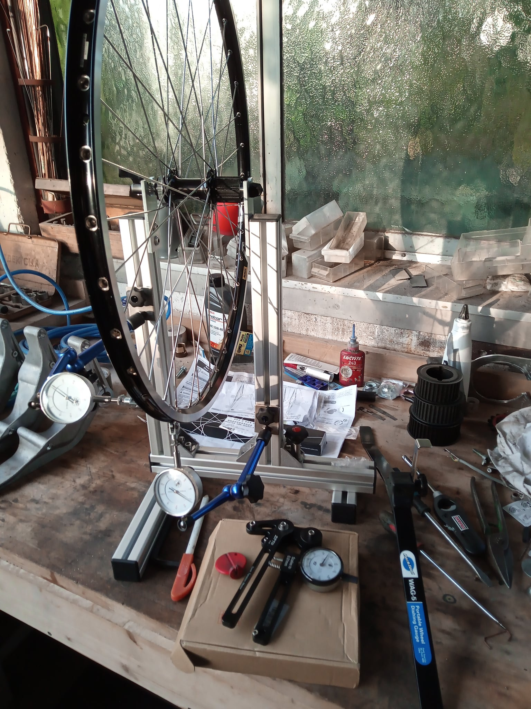

created 23-09-2021

# pybicyclewheel

`pybicyclewheel` calulates the required spoke length for bicycle wheels.

this page is under construction.

browse git repo [https://github.com/kr-g/pybicyclewheel](https://github.com/kr-g/pybicyclewheel) to explore the code.

## todo documentation

- media files
- screenshots
- links to media on topic diy wheel building

## installation

install with [`pip`](https://packaging.python.org/tutorials/installing-packages/).

all versions available on pypi: [https://pypi.org/project/pybicyclewheel/](https://pypi.org/project/pybicyclewheel/)

## sourcecode

github: [https://github.com/kr-g/pybicyclewheel](https://github.com/kr-g/pybicyclewheel)

## media 

wheel truing stand

### legal information

This page is hosted on [github pages](https://pages.github.com/).
Read more: [Privacy information](https://help.github.com/en/articles/github-privacy-statement)
  
